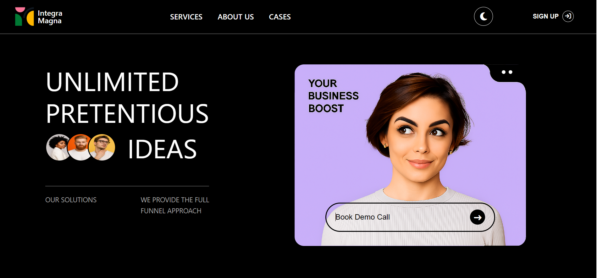
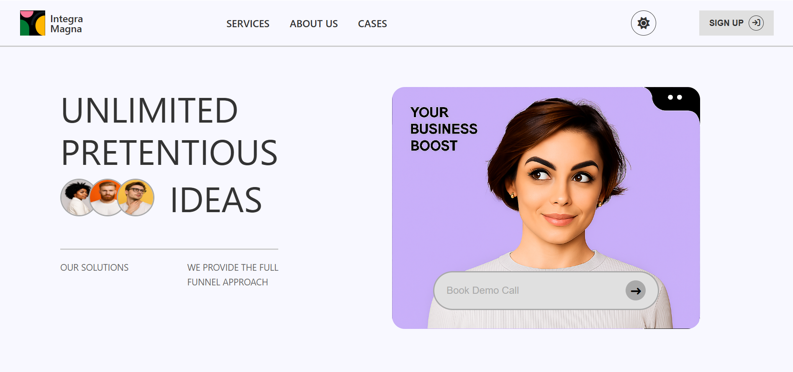

Integra Magna Landing Page UI Challenge
This project is a submission for the Integra Magna Web Developer Internship Technical Task. The goal was to build a functional, interactive, and responsive landing page that accurately replicates a given design, with a strong focus on structure, user experience, and responsiveness.

Features Implemented
This landing page goes beyond basic replication by incorporating several interactive and dynamic elements to enhance the user experience.

Core Requirements:
Design Replication: The page meticulously recreates the provided layout, including the unique logo, navigation, hero section, and the distinctive card grid.

Modern, Dark-Themed UI: A clean, contemporary dark theme is consistently applied throughout the interface, establishing a professional aesthetic.

Full Responsiveness: The layout is designed to adapt seamlessly across a wide range of screen sizes, from mobile phones to large desktop displays, ensuring optimal viewing and usability.

Adaptive Navigation: The navbar smoothly transitions to a stacked layout on smaller screens.

Flexible Hero Section: Content scales proportionally to fit various viewport widths.

Dynamic Card Grid: The main content cards adjust their layout, stacking vertically on smaller devices while maintaining their unique overlapping design on larger screens.

CSS Flexbox and Grid: Extensively utilized for robust and efficient layout management across all sections, promoting maintainability and responsiveness.

Bonus (Optional Enhancements):
Dark and Light Mode Toggle: A user-friendly toggle allows visitors to switch between a dark and a light theme. The chosen theme persists across browser sessions using localStorage, and the toggle button icon dynamically updates (moon/sun) to reflect the current mode.

Micro-interactions & Dynamic Animations:

Scroll-Triggered Animations: The left-hand filter buttons and the main content cards (.left-button, .card) elegantly fade in and slide up as they enter the viewport, creating a polished and engaging reveal effect.

Hero Title Typing Effect: The primary hero title words ("UNLIMITED", "PRETENTIOUS", "IDEAS") animate sequentially, appearing with a typing-like or revealing motion on page load, immediately drawing attention.

Dynamic Avatar Animation: The avatar images within the hero section slide in from the left with a subtle staggered effect, synchronized to appear after the "IDEAS" word.

Enhanced Button Hover Effect: The "Book Demo Call" button within the hero image box reacts with a subtle upward translation and shadow on hover, making the call-to-action more prominent.

Re-triggering Animations on Theme Switch: All primary entrance animations (hero title words, avatars, and scroll-triggered elements) re-play when the theme is toggled, providing a fresh and dynamic feel to the interface change.

Code Structure & Cleanliness
Semantic HTML5: The index.html file uses appropriate semantic tags (<header>, <nav>, <section>, <main>, <aside>) for clear structure and improved accessibility.

Modular CSS: The style.css is well-organized, leveraging CSS Custom Properties (Variables) for colors (:root and .light-mode) to enable efficient theme management and consistent styling. Media queries are clearly defined for each responsive breakpoint.

Structured JavaScript: The script.js file is logically segmented into distinct functions for theme toggling, hero section animations, and scroll-triggered effects. This separation enhances readability, reusability, and maintainability.

Efficient Animations:

The IntersectionObserver API is used for scroll-triggered animations, ensuring optimal performance by only animating elements when they are visible in the viewport.

Animation resets and re-triggers are carefully managed using setTimeout and forcing browser reflows (void element.offsetWidth;) to ensure smooth and reliable animation playback on theme changes and initial load.

Local Storage Integration: User theme preferences are persistently stored, providing a consistent experience across visits.

Thought Process & Approach
My approach to this challenge was multi-faceted, balancing design fidelity with a focus on user experience and code quality:

Foundational HTML: I started by establishing the core HTML structure, breaking the page down into logical sections and identifying key elements for styling and interaction.

Modular & Themable CSS: Recognizing the dark/light mode requirement, I prioritized setting up CSS variables from the outset. This allowed for centralized color management and simplified theme switching. I built the initial dark theme, then implemented the light mode overrides.

Iterative Responsiveness: While the overall design was clear, I approached responsiveness iteratively. After getting the basic desktop layout, I used browser developer tools to simulate various screen sizes and refined layouts, font sizes, and spacing at key breakpoints using media queries. Flexbox and Grid were crucial for creating flexible and adaptive containers.

Prioritizing User Engagement: For the "Bonus Enhancements," I selected interactions that would make the page feel more premium and dynamic. The hero section animations were chosen for their immediate visual impact, while scroll-triggered animations provide a professional reveal for content as users explore the page. Re-triggering animations on theme switch was a refinement to make the theme change itself a micro-interaction.

JavaScript for Dynamic Behavior: JavaScript was leveraged to handle complex interactions that CSS alone couldn't achieve, such as persistent theme toggling, staggered text/image animations, and precise control over animation re-triggers.

Challenges Faced & Solutions
CSS Specificity Conflicts in Animations:

Challenge: When combining CSS transform properties from different rules (e.g., a base class for scroll animation and a :hover pseudo-class), specificity could lead to one overriding the other, breaking the desired effect (e.g., card hover not working after being scroll-animated).

Solution: I resolved this by increasing the specificity of the hover rules (e.g., .card.is-visible:hover) to ensure they took precedence when an element was both visible and hovered upon.

Re-triggering Animations on Theme Toggle:

Challenge: Making complex entrance animations (like the hero title and avatars) re-play smoothly every time the user toggles the theme was tricky. Simply removing and re-adding classes often didn't work consistently due to browser optimization (it wouldn't "see" a change to animate).

Solution: I implemented a technique to force a browser reflow (void element.offsetWidth;) after removing the animation classes and before re-adding them. This tells the browser to re-calculate layout, effectively resetting the element's visual state and allowing the CSS transitions to re-fire correctly. For scroll-triggered elements, I also had to explicitly unobserve() and then observe() them again with the IntersectionObserver to make them "re-detect" as intersecting.

Local Image Paths for GitHub Deployment:

Challenge: Ensuring images load correctly when the project is hosted, especially if initially developed with different local paths or placeholders.

Solution: The HTML code is set up to use relative paths (./images/image-name.png). For GitHub deployment, it's crucial to create an images folder in the project root and place all image assets there, ensuring these relative paths correctly point to the assets.

How to Run the Project
To view this landing page locally or deploy it:

Clone the Repository:

git clone https://github.com/Yagyik88/Integra-Magna.git

Navigate to the Project Directory:

cd Integra-Magna

Screenshots
To best showcase the implemented dark and light theme toggles, here are screenshots of the landing page in both modes. These images are stored in the ./images/ folder within this repository.

Dark Theme

Light Theme
